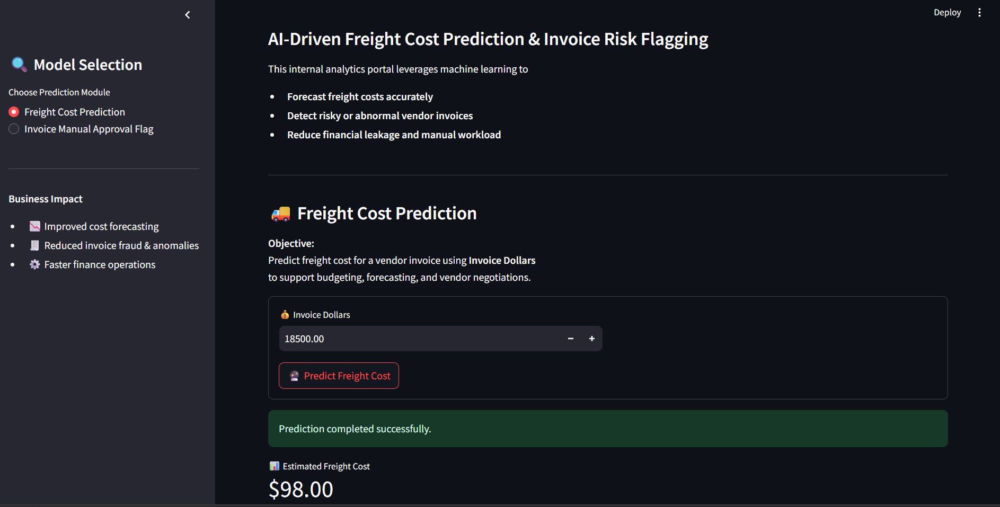
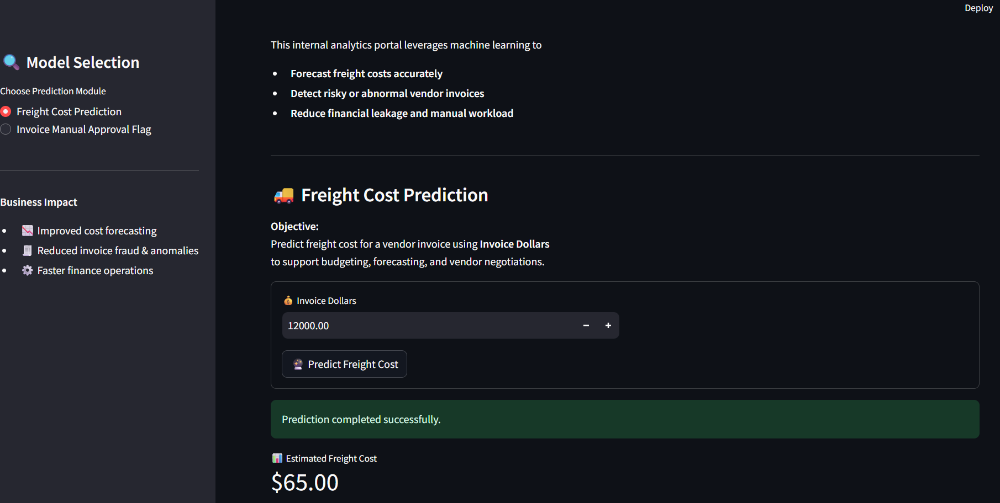
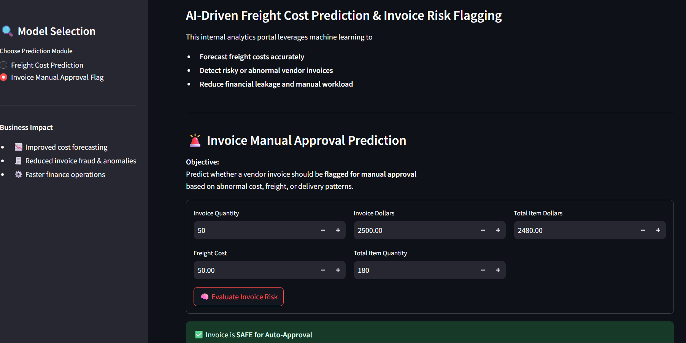
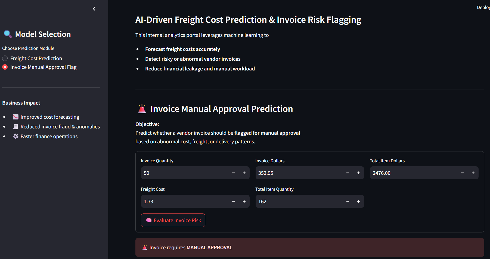

# 🚀 Vendor Invoice Intelligence System

An end-to-end Machine Learning project designed to:

* 📊 Predict Freight Cost (Regression)
* 🚨 Detect Risky Invoices (Classification)

This system helps automate financial decision-making and reduce manual approval workload.

---

## 📌 Project Overview

This project assists finance teams by:

* 📦 Predicting freight cost for invoices
* 🚨 Detecting high-risk invoices requiring manual approval
* 💰 Reducing financial leakage and manual effort

---

## ⭐ Key Features

* End-to-end ML pipeline (data → model → deployment)
* Feature engineering using SQL aggregation
* Model comparison (Linear, Decision Tree, Random Forest)
* Hyperparameter tuning using GridSearchCV
* Real-time prediction using Streamlit UI

---

## 📂 Data Source

* Data stored in SQLite database (`inventory.db`)
* Includes invoice-level and item-level transaction data
* Features engineered using SQL aggregation

---

## 📂 Dataset

Due to GitHub file size limits, the dataset is not stored in this repository.

Instead, it is hosted on Google Drive.

### 🔽 Download Dataset

Run:

```bash
python download_db.py

---
```
## 🛠 Tech Stack

* Python
* Pandas, NumPy
* Scikit-learn
* Streamlit
* Joblib

---
```
## 📁 Project Structure

```
Inventory-Invoice-Analytics/

├── data/
│   └── inventory.db

├── freight_cost_prediction/
│   ├── data_preprocessing.py
│   ├── modeling_evaluation.py
│   ├── train.py

├── invoice_flagging/
│   ├── data_preprocessing.py
│   ├── modeling_evaluation.py
│   ├── train.py

├── inference/
│   ├── predict_freight.py
│   ├── predict_invoice_flag.py

├── models/
│   ├── predict_freight_model.pkl
│   ├── predict_flag_invoice.pkl
│   ├── scaler.pkl

├── images/
│   ├── freight_normal.png
│   ├── freight_low.png
│   ├── invoice_safe.png
│   ├── invoice_manual.png

├── app.py
├── requirements.txt
└── README.md
----download_db.py

```

---

## 📸 Output Screens

### 📊 Freight Cost Prediction

#### Normal Case



#### Low / Different Case



---

### 🚨 Invoice Risk Prediction

#### ✅ SAFE Case



#### 🚨 Manual Approval Case



---

## 🔍 Invoice Risk Prediction Output

The model predicts whether an invoice is safe or requires manual approval.

* **0 → SAFE for Auto Approval**
* **1 → Requires MANUAL APPROVAL**

---

## 🧠 Decision Logic

The prediction is based on:

* 📊 Difference between *Invoice Dollars* and *Total Item Dollars*
* 🚚 Freight cost relative to invoice amount
* ⏱ Delivery delay (receiving delay)

---

## ✅ Example (SAFE Case)

| Feature             | Value |
| ------------------- | ----- |
| Invoice Quantity    | 50    |
| Invoice Dollars     | 2500  |
| Total Item Dollars  | 2480  |
| Freight Cost        | 50    |
| Total Item Quantity | 160   |

👉 Output: **0 (SAFE for Auto Approval)**

---

## 🚨 Example (Manual Approval Case)

| Feature             | Value |
| ------------------- | ----- |
| Invoice Quantity    | 50    |
| Invoice Dollars     | 2500  |
| Total Item Dollars  | 1500  |
| Freight Cost        | 800   |
| Total Item Quantity | 160   |

👉 Output: **1 (Requires MANUAL APPROVAL)**

---

## 🤖 Models Used

### 📊 Regression (Freight Cost)

* Linear Regression
* Decision Tree Regressor
* Random Forest Regressor (**Final Model**)

### 🚨 Classification (Invoice Flagging)

* Logistic Regression
* Decision Tree Classifier
* Random Forest Classifier (**Final Model**)

---

## 📈 Evaluation Metrics

### Regression

* MAE (Mean Absolute Error)
* RMSE
* R² Score

### Classification

* Accuracy
* Precision, Recall, F1-score
* Classification Report

---

## 🚀 Future Improvements

* Deploy on cloud (Streamlit Cloud / AWS)
* Add real-time database integration
* Improve model accuracy using advanced algorithms

---

## ⚙️ How to Run

### 1️⃣ Install Dependencies

```bash
pip install -r requirements.txt
```

### 2️⃣ Run the App

```bash
streamlit run app.py
```

---

## 👨‍💻 Author

**Hardik Chaudhary**
B.Tech CSE | Aspiring Data Analyst / Data Scientist

📧 Email: [hardik1chaudhary@gmail.com](mailto:hardik1chaudhary@gmail.com)
